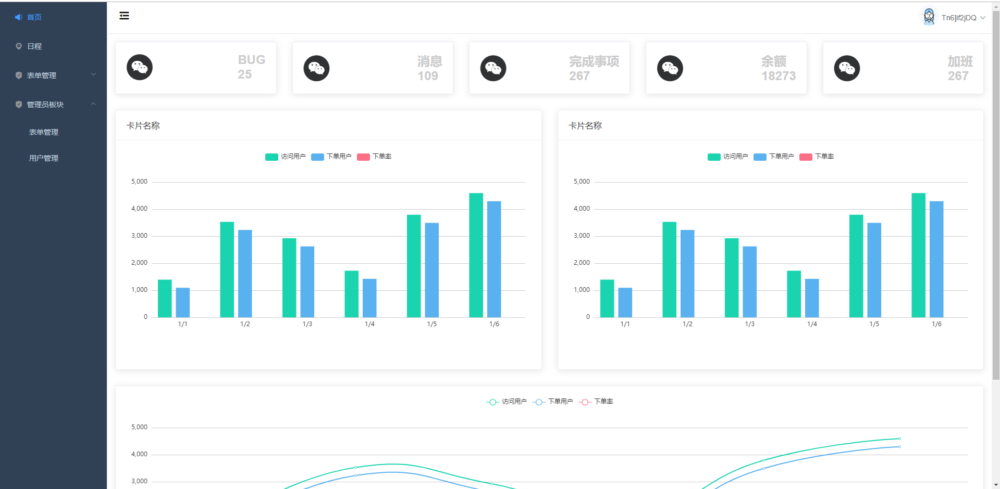

# admin template

# 介绍
经过了一个后台管理项目的心得，因为前面都是通过后台给的routesJSON数据来去渲染项目的导航列表，这一次是渲染本地路由列表进行配置，然后去进行权限鉴定。
特地做了一个模板做总结，方便下次重构。

## 使用
克隆存储库
>git clone https://github.com/wangly19/admin-mytemplate-vuejs.git

进入项目
>cd admin-mytemplate-vuejs

安装依赖
>npm install 

启动服务
> npm run serve

## 首页
